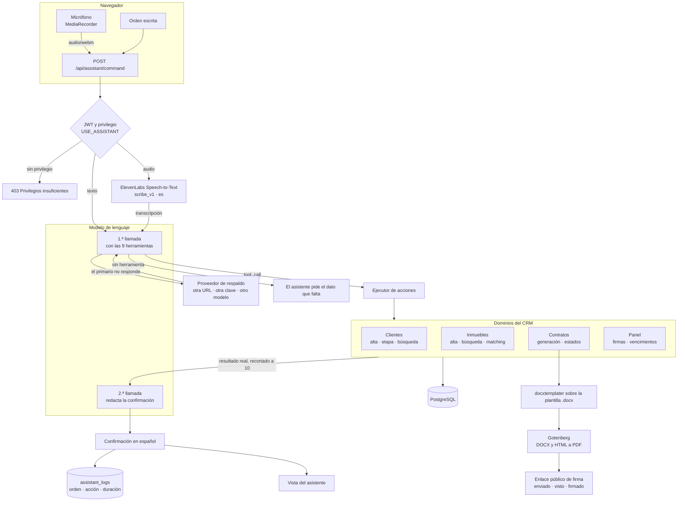

# CRM inmobiliario con agentes de voz

[](https://github.com/babyyoda62406/demo-crm-voz/actions/workflows/ci.yml)

CRM a medida para un despacho de personal shopper inmobiliario que trabaja tres
líneas a la vez —búsqueda de inmuebles para inversores, alquiler temporal a
empresas y seguimiento de reformas— y que hasta entonces las llevaba en tres
hojas de cálculo distintas. Lo que lo diferencia de un CRM genérico es que las
operaciones más repetitivas se dictan: se habla al micrófono, un modelo de
lenguaje traduce la frase en una llamada a una herramienta del propio CRM, la
acción se ejecuta de verdad contra la base de datos y el sistema contesta con la
confirmación redactada.

## El repositorio en cifras

| Concepto | Cantidad |
| --- | --- |
| Ficheros versionados | 388 |
| Líneas de TypeScript / TSX (sin tests) | 45.716 |
| Líneas de tests | 2.448 |
| Backend (`back/src`) | 23.833 líneas |
| Frontend (`front/src`) | 21.866 líneas |
| Módulos de NestJS | 12 |
| Entidades de TypeORM | 15 |
| Controladores / endpoints REST | 12 / 125 |
| DTOs con validación | 48 |
| Vistas de React / componentes `.tsx` | 9 / 82 |
| Herramientas expuestas al modelo | 9 |
| Privilegios de autorización | 33 |
| Plantillas de contrato en Word | 5 |
| Suites de test / tests | 11 / 169 |

Las cifras están contadas sobre este árbol; `npm test` reproduce las dos últimas.

## Cómo fluye una orden



## Decisiones de ingeniería

**Dos proveedores de LLM en cadena, con failover de verdad.** El asistente
pregunta al primario y, si no responde, repite la misma petición contra un
proveedor distinto: otra URL, otra clave y otro modelo. «No responder» incluye
agotar el tiempo de espera, caerse la red, devolver un HTTP >= 400 y —esto es lo
que se suele olvidar— contestar un 200 sin contenido aprovechable. Antes los dos
intentos iban al mismo sitio cambiando solo de modelo, así que una clave caducada
se llevaba por delante el asistente entero. Un 401 del primario ya no corta la
cadena salvo que el respaldo comparta origen y clave, porque es justo el caso
para el que existe. Los tiempos de espera no son redondos por gusto: están
medidos contra cada proveedor y documentados en `.env.template`.

**El asistente no conoce ninguna clase de dominio.**
`common/contracts/assistant-actions.ts` declara las interfaces (`IClientActions`,
`IPropertyActions`, `IContractActions`, `IDashboardQueries`) y los tokens de
inyección; cada servicio de dominio las implementa y se registra bajo su token.
El módulo del asistente se inyecta contra el token con `@Optional()`, de modo que
un dominio que no esté montado no rompe el arranque: la herramienta simplemente
se anuncia como no disponible en `GET /api/assistant/status`. Ningún método de
dominio lanza por un error de negocio esperado; todos devuelven
`{ ok, mensaje, data }` con el mensaje ya escrito en español, listo para que el
modelo lo lea o para mostrarlo tal cual si el modelo falla.

**Lo que se le enseña al modelo del resultado está recortado a propósito.** La
lista de elementos que viaja de vuelta al modelo son 10 como máximo, y el campo
se llama `mostrados`, nunca `total`. Mientras se llamó `total`, el modelo lo
tomaba por la respuesta y contestaba «hay 10 clientes» teniendo 24, aunque el
recuento bueno viniera escrito al lado. El prompt del sistema insiste en copiar
la cifra de `mensaje`, y una capa de normalización descarta las etapas que el
modelo se inventa: «activos», «en cartera» o «todos» no son etapas del embudo y
filtrar por ellas devolvía cero clientes con toda la apariencia de haber
funcionado.

**La numeración de facturas es correlativa de verdad.** El número se reserva
dentro de la transacción de alta, tomando antes un `pg_advisory_xact_lock`
parametrizado por ejercicio: dos usuarios emitiendo a la vez no pueden repetir
número, y dos ejercicios distintos numeran en paralelo sin bloquearse. Una
factura emitida no se borra: el endpoint de borrado existe para responder por qué
no, porque borrar la fila quemaba un número del correlativo para siempre. Se
anula, conserva su número y sale de los totales del periodo. El importe tampoco
se puede editar una vez emitida.

**Las plantillas de contrato son los Word del despacho, no una reimplementación.**
Word parte una misma frase en varios `<w:r><w:t>`, así que un hueco marcado con
puntos suspensivos puede estar repartido entre tres runs y un `search & replace`
sobre el XML no funciona. `assets/templates/herramientas/etiquetar-plantillas.js`
reconstruye el texto de cada párrafo, aplica las reglas sobre texto plano y
redistribuye el resultado entre los runs originales: tipografía, negritas y
márgenes quedan intactos. Al generar, el servicio además reescribe
`docProps/core.xml`, porque LibreOffice copiaba al PDF el nombre de quien había
redactado la plantilla y el cliente lo veía en las propiedades del contrato.

**El circuito de firma deja traza y sobrevive a sus propios fallos.** Enviar
acuña un token aleatorio de 24 bytes y pasa a `enviado`; abrir el enlace mueve a
`visto` y sella la fecha (reenviar limpia esa marca, para no decir que el cliente
ya lo ha abierto cuando no); firmar sella nombre, IP y fecha y rehace el PDF con
una página de diligencia dentro. Si la conversión a PDF falla, la firma no se
deshace: ya está registrada y el documento se puede rehacer luego desde la ficha.

**La semilla de demostración se puede retirar sin adivinar.** En vez de añadir
una columna `esDemo` a media docena de tablas de otros dominios, la semilla anota
en `configs` el inventario exacto de identificadores que ha escrito. Retirar la
demo deja de ser un ejercicio de «¿este cliente es de verdad o es de la demo?» y
pasa a ser un borrado de lo anotado y nada más.

**Autorización con el mismo vocabulario en los dos lados.** Los 33 privilegios
viven en un enum del backend y se repiten en el frontend; `routePrivileges.ts`
asocia cada ruta al privilegio exacto que su controlador exige en el `@Auth(...)`.
Mientras esa tabla estuvo a `null`, el menú ofrecía a un rol de solo lectura
pantallas cuya API le respondía 403.

**ONLYOFFICE necesita tres URLs porque hay tres puntos de vista.** Cómo ve el
backend al Document Server, cómo lo ve el navegador y cómo ve el contenedor de
ONLYOFFICE a la API del CRM son tres respuestas distintas en cuanto hay Docker de
por medio. Están las tres separadas y documentadas en `.env.template`, que es
donde más se falla en esta integración.

## Arrancarlo

```bash
cp .env.template .env && npm install     # 1. variables y dependencias
npm run docker:dev && npm run seed       # 2. Postgres, Gotenberg, ONLYOFFICE y datos de demo
npm run dev                              # 3. API en :3000/api y front en :5173
```

Swagger queda en <http://localhost:3000/api/docs>. El usuario semilla es
`admin@crmia.local` con la contraseña de `ADMIN_PASSWORD`. Para parar la
infraestructura: `npm run docker:dev:down` (los datos persisten en volúmenes).

Sin `LLM_API_KEY` la aplicación arranca igual: el asistente se declara no
configurado y el resto del CRM funciona. Sin `ELEVENLABS_API_KEY` se pierde el
dictado, pero las órdenes escritas siguen funcionando.

| Comando | Qué hace |
| --- | --- |
| `npm run typecheck` | `tsc --noEmit` en los dos workspaces |
| `npm run lint` | ESLint en los dos workspaces |
| `npm test` | Jest sobre el backend |
| `npm run build` | Compila `back/dist` y `front/dist` |

## Variables de entorno

Todas están documentadas en `.env.template`. Las que hay que rellenar para tener
el producto completo:

| Variable | Para qué |
| --- | --- |
| `DB_HOST`, `DB_PORT`, `DB_USERNAME`, `DB_PASSWORD`, `DB_DATABASE` | PostgreSQL |
| `JWT_SECRET`, `JWT_EXPIRES_IN` | Firma de los tokens de sesión |
| `ADMIN_PASSWORD` | Contraseña del administrador que se crea en el primer arranque |
| `LLM_API_KEY`, `LLM_BASE_URL`, `LLM_MODEL`, `LLM_TIMEOUT_MS` | Proveedor de LLM primario (endpoint compatible con OpenAI) |
| `LLM_FALLBACK_*` | Proveedor de respaldo; si se deja vacío hereda del primario |
| `ELEVENLABS_API_KEY` | Transcripción de voz |
| `GOTENBERG_URL` | Conversión a PDF |
| `ONLYOFFICE_URL`, `ONLYOFFICE_PUBLIC_URL`, `ONLYOFFICE_INTERNAL_API_URL`, `ONLYOFFICE_JWT_SECRET` | Edición de documentos |
| `UPLOADS_DIR` | Carpeta de ficheros subidos |
| `AGENCY_*`, `AGENCIA_*` | Datos fiscales y de marca que salen en facturas y contratos |
| `CADDY_SITE_ADDRESS`, `CADDY_EMAIL`, `FRONTEND_URL` | Solo despliegue con `docker-compose.prod.yml` |

## Qué NO está

- **La firma electrónica no es cualificada.** El circuito registra nombre, IP y
  fecha y genera una página de diligencia dentro del PDF, pero no hay
  certificado, ni sellado de tiempo, ni prestador de servicios de confianza.
- **No se envía correo.** Enviar un contrato genera el enlace público; hacerlo
  llegar al destinatario queda fuera.
- **No hay migraciones.** El esquema se crea con `DB_SYNCHRONIZE`, que es cómodo
  para una demo y no es lo que debería usarse con datos reales.
- **`strictNullChecks` está desactivado en el backend.** El resto de las opciones
  estrictas de TypeScript sí están activas (`noImplicitAny`,
  `strictFunctionTypes`, `noUnusedLocals`, `noImplicitOverride`…) y el frontend va
  con `strict: true` completo. Activarlo en el backend saca a la luz 97 errores
  concentrados en la capa de TypeORM; queda pendiente y se dice en vez de
  disimularlo.
- **No hay tests de extremo a extremo ni del frontend.** Los 169 tests son
  unitarios y de integración del backend, con dobles para ElevenLabs, el
  proveedor de LLM y el repositorio.
- **No es multiempresa.** Hay una única agencia, configurada por entorno.

## Sobre esta versión pública

Este repositorio es la versión publicable de un proyecto entregado a un cliente
real. Antes de publicarlo se sustituyó todo lo que permitía identificarlo:

- La marca del despacho, su razón social, su CIF, su domicilio, su IBAN y su
  dominio son inventados. La agencia se llama aquí **Vantia Patrimonio, S.L.**,
  con CIF `B00000000` e IBAN `ES00 0000 0000 0000 0000 0000`.
- Las siete zonas de operación son localidades inventadas (Altabria, Valdemor,
  Serranova, Puentealba, Maralta, Albamar y Ribaverde), en dos provincias que
  tampoco existen. Los códigos postales empiezan por `00`, que no se usa en
  España.
- Los clientes, empresas, firmantes, teléfonos, correos, documentos de identidad
  y direcciones de la semilla son ficticios. Los NIF tienen letra de control
  correcta para que las validaciones se puedan probar, pero no corresponden a
  nadie.
- Los documentos de ejemplo del Drive (dosieres, parte de reformas, tarifas y
  checklist) se reescribieron con cifras inventadas. Las plantillas `.docx`
  conservan su estructura legal pero se les quitaron los datos de la agencia y
  los metadatos de autoría; los borradores de partida del cliente no se publican.
- La infraestructura de despliegue del autor (dominios, hosts, direcciones IP) se
  sustituyó por valores de documentación.
- El historial de Git empieza de cero: un único commit. No hay nada que rescatar
  de commits anteriores.

Cualquier parecido de los datos de demostración con personas o empresas reales es
casualidad.

---

Deivis Torres Mena — [github.com/babyyoda62406](https://github.com/babyyoda62406)
